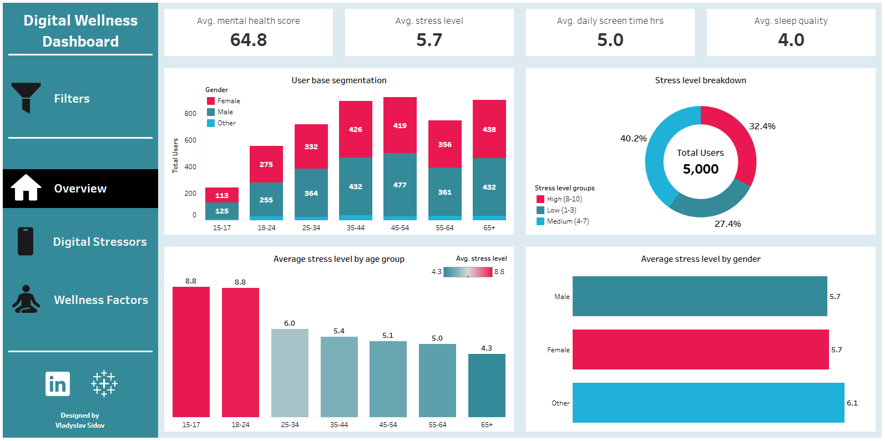
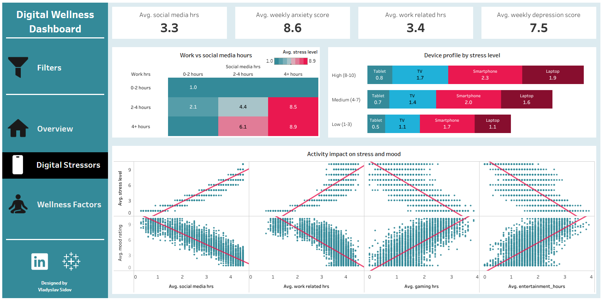
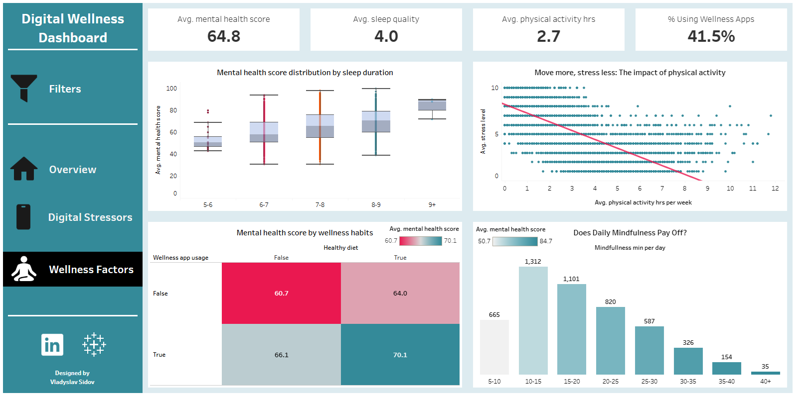

# 📊 Dashboard Analysis: Key Findings

This report details the primary insights uncovered from the "Digital Wellness Dashboard" analysis, based on a dataset of 5,000 users.

---

## 🖼️ 2. Page 1: The "Big Picture" Overview

This page sets the context of the problem. 

* **Overall KPIs:**
    * **Average Stress Level:** **5.7 / 10**
    * **Average Mental Health Score:** **64.8 / 100**
    * **Average Sleep Quality:** **4.0 / 5**
    * **Average Daily Screen Time:** **5.0 hours**

---

### Core Visualizations & Findings

#### 1. User base segmentation & Average stress level by gender (2 Bar Charts)

* These charts show the demographic breakdown of the user base, first by age group and then by gender, alongside the average stress level for each gender.

    * **User Distribution (Age):** The largest group is 45-54 (18.4%), while the smallest is 15-17 (5.0%). This confirms the 8.8 stress level for the 15-17 group is a significant finding, not just an anomaly.
    * **User Distribution (Gender):** The split is 48.8% Male, 47.2% Female, and 4.0% Other.
    * **Stress by Gender:** The analysis reveals that gender is **not a significant driver of stress** in this dataset, with Male and Female users reporting an average identical to the overall cohort.
      * **Male:** **5.7 / 10**
      * **Female:** **5.7 / 10**
      * **Other:** **6.1 / 10**

* **Key Finding:** The extreme 8.8 stress level for the 15-17 group is not a statistical anomaly - it's a critical insight from the smallest and most vulnerable sample group.

#### 2. Stress Level Breakdown (Donut Chart)

* This chart segments the entire user base into three distinct stress categories (Low, Medium, and High) to show the overall prevalence of stress.

    * **High Stress (Score 8-10):** 32.4%
    * **Medium Stress (Score 4-7):** 40.2%
    * **Low Stress (Score 1-3):** 27.4%

* **Key Finding:** Nearly one-third (32.4%) of all users fall into the "High Stress" category. When combined with the "Medium" group, over 72% of the sample is experiencing moderate to high stress.

#### 3. Average stress level by age group (Bar Chart)

* This chart shows the average stress level for each age group, revealing how stress perception changes throughout a user's life.

    * **Peak Stress:** The 15-17 and 18-24 age groups report a high average stress level of 8.8/10.
    * **The "Adulthood" Drop:** Stress drop by 2.8 points for the 25-34 group (6.0/10).
    * **Steady Decline:** Stress continues a steady, gradual decline throughout age groups, reaching its lowest point for people 65+ (4.3/10).

* **Key Finding:** This dashboard proves the problem with high stress level is highly concentrated in Gen Z. 

---

## 🖼️ 3. Page 2: Identifying the "Digital Stressors"

This section diagnoses the source of the stress.

* **Overall KPIs:**
    * **Average Social Media Time:** **3.3 hours**
    * **Average Weekly Anxiety Score:** **8.6 / 21**
    * **Average Work Related Time:** **3.4 hours**
    * **Average Weekly Depression Score:** **7.5 / 21**

---

### Core Visualizations & Findings

#### 1. Work vs social medis hours (Heatmap)

* This heatmap shows the average stress level for users based on the combined hours they spend on work and social media.
    
    * **Red Zone (8.9/10 Stress):** 4+ work hours AND 4+ social media hours.
    * **Green Zone (1.0/10 Stress):** 0-2 work hours AND 0-2 social media hours.

* **Key Finding:** This heatmap proves that stress is compounded by combining activities. The "Red Zone" group, with 4+ hours of both work and social media, has an average stress level of 8.9/10, which is nearly 900% higher than the "Green Zone" (1.0/10) of users who do little of either. 

#### 2. Device profile by stress level (Stacked Bar Chart)

* This stacked bar chart shows the total average screen time for each stress group, broken down by the type of device used.
    
    * **High Stress Group:** 2.3 hrs (Smartphone), 1.9 hrs (Laptop), 1.7 hrs (TV), 0.8 hrs (Tablet)
    * **Medium Stress Group:** 2.0 hrs (Smartphone), 1.6 hrs (Laptop), 1.4 hrs (TV), 0.7 hrs (Tablet)
    * **Low Stress Group:** 1.7 hrs (Smartphone), 1.1 hrs (Laptop), 1.1 hrs (TV), 0.5 hrs (Tablet)

* **Key Finding:** This chart reveals that the "High Stress" group has the highest total volume of screen time (6.7 hours). This is more than the "Medium" (5.7 hours) and "Low" (4.4 hours) stress groups.

#### 3. Activity impact on stress and mood (Multiple Scatter Plots)

* This grid of scatter plots shows the relationship (or correlation) between specific digital activities and user wellness outcomes (Stress Level and Mood Rating).

    * **"Toxic" Activities (High Stress / Low Mood):**
        * Work-Related Hours
        * Social Media Hours
    * **"Protective" Activities (Low Stress / High Mood):**
        * Gaming Hours
        * Entertainment Hours

* **Key Finding:** This grid clearly separates screen time into two distinct categories: "Toxic" and "Protective." "Toxic" activities (Work, Social Media) show a clear correlation with higher stress and lower mood, while "Protective" activities (Gaming, Entertainment) show the exact opposite.

---

## 🖼️ 4. Page 3: Analyzing the "Wellness Factors"

This section identifies the most effective solutions to combat stress.

* **Overall KPIs:**
    * **Average Mental Health Score:** **64.8 / 100**
    * **Average Sleep Quality:** **4.0 / 5**
    * **Average Physical Activity Time Per Week:** **2.7 hours**
    * **Percentage Using Wellness Apps:** **41.5%**

---

### Core Visualizations & Findings

#### 1. Mental health score distribution by sleep duration (Boxplot)

* This boxplot shows how the distribution of mental health scores (from the median to the outliers) changes based on how many hours of sleep users get each night.

* **Key Finding:** Sleep duration has a massive impact on mental health. The median mental health score for users getting **9+ hours** of sleep is **88/100**. This score drop to **51/100** for those getting only **5-6 hours**. This 37-point difference is one of the largest single factors in the dataset.

#### 2. Move more, stress less: The impact of physical activity (Scatter Plot)

* This scatter plot shows the relationship between a user's weekly hours of physical activity and their reported stress level, revealing if a trend exists.

* **Key Finding:** The analysis confirmed a strong, clear negative correlation between physical activity and stress. The more hours of physical activity per week, the lower the average stress level.

#### 3. Mental health score by wellness habits (Heatmap)

* This heatmap shows the combined effect of two different habits - using wellness apps and eating a healthy diet - on the average mental health score for each of the four possible groups.

    * **Baseline (No Apps, No Diet):** 60.7 Mental Health Score
    * **Diet Only:** 64.0 (+3.3 pts)
    * **Apps Only:** 66.1 (+5.4 pts)
    * **Apps and Healthy Diet:** **70.1 (+9.4 pts)**

* **Key Finding:** Proactive habits demonstrate a clear "synergy" or compounding effect. While each individual habit (using wellness apps, eating healthy) provides a moderate boost, users who practice both see a +9.4 point jump in their mental health score.

#### 4. Does Daily Mindfulness Pay Off (Bar Chart)

* This bar chart shows the average stress level for users, grouped into "bins" based on the number of mindfulness minutes they practice daily.
    
    * **5-10 min/day:** 9.2 / 10 Stress Level (665 users)
    * **10-15 min/day:** 7.4 / 10 Stress Level (1312 users)
    * **20-25 min/day:** 4.5 / 10 Stress Level (820 users)
    * **40+ min/day:** 1.0 / 10 Stress Level (35 users)

* **Key Finding:** This visualization reveals a powerful relationship between mindfulness and stress. As daily practice increases, stress levels systematically decrease, dropping from a high of 9.2/10 for the 5-10 minute group to a near-nonexistent 1.0/10 for those practicing 40+ minutes.

---

## 💡 5. Top 3 Key Insights

* **Insight 1: The stress problem is a "Generational Crisis," not a "Gender Gap."**

  * The Overview page immediately disproves a common myth. The data shows no statistical difference in stress levels between Males (5.7/10) and Females (5.7/10). However, it reveals a massive "Generational Crisis": the 15-24 age group is the epicenter of the stress problem, with an explosive average stress level of 8.8/10. This finding is critical, as it proves that age (and the behaviors associated with it) is the single most important demographic driver of stress, while gender is a non-factor.

* **Insight 2: "Screen Time" is a useless metric; the "Digital Cocktail" is what matters.**

  * This dashboard proves that combining all screen time together is a mistake. The data clearly separates digital activities into two opposing categories:

    * "Toxic Activities" (Work & Social Media), which show a strong positive correlation with stress and negative correlation with mood.

    * "Protective Activities" (Gaming & Entertainment), which show the exact opposite, correlating with lower stress and higher mood.

* This insight reframes the entire problem: the solution isn't just "less screen time," it's "rebalancing the mix" away from toxic, high-stress activities.

* **Insight 3: Sleep is the "Silver Bullet" with the highest ROI.**

  * The Wellness page reveals a massive 37-point gap in median mental health scores between users who get 5-6 hours of sleep (51/100) and those who get 9+ hours (88/100). This is the largest, most powerful predictive factor in the entire dataset, making it the most critical and actionable factor for improving well-being.

